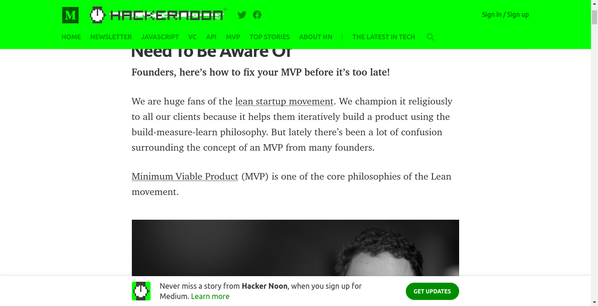
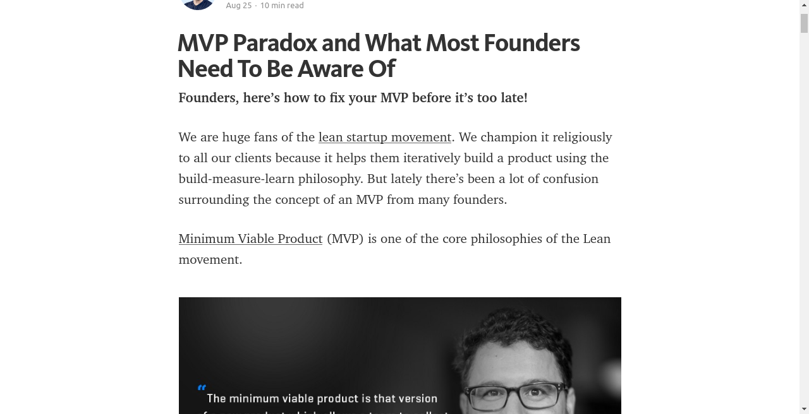

	

	
	

Make Medium Readable Again is a [Chrome extension](https://chrome.google.com/webstore/detail/kljjfejkagofbgklifblndjelgabcmig) and [Firefox add-on](https://addons.mozilla.org/addon/make-medium-readable-again/) that improves a reading experience ruined by user engagement tactics. Medium was actually readable once; this extension aims to help people pay attention to writers' words again instead of Medium's UX.

### Improves readability by

* Keeping the top navigation bar from sticking around
* Hiding the bottom "Get Updates" bar completely
* Shrinking massive header images
* (Optionally) hiding the clap / share bar
* (Optionally) loading all post images up front, instead of lazy loading as you scroll
* (Optionally) disabling the popup menu that appears when selecting text

### Preview

_Unreadable Medium_
<kbd></kbd>

_Medium Made Readable Again_
<kbd></kbd>

### Contributing

Want to improve something? Please do! Send a pull request or file an issue!

### License

MIT

### Credits

I'm Matt Baer, and I like building software that thinks about its users. Inspired by this and a time when Medium was more readable, I built a writing platform called [Write.as](https://write.as) that [works great if you never sign up](https://write.as/new), [lets you read](https://read.write.as), and leaves out the comments, claps, and [dickbars](https://daringfireball.net/2017/06/medium_dickbars). It's perfect for when you just need to get your thoughts out — and if you want to share, you can always cross-post to Medium.
